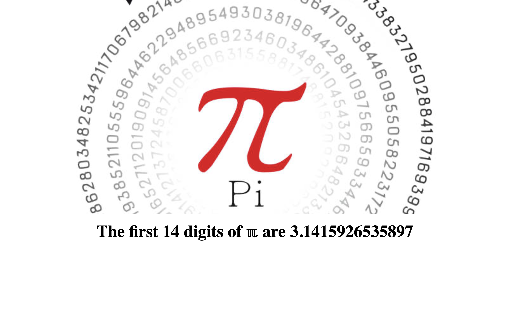

# PI-Digit-Calculator
App to calculate digits of Pi using Flask Celery - project for the JetBrains PostTagger Reimagined internship application



[](https://github.com/Frexmax/PI-Digit-Calculator/actions/workflows/build.yml)
[](https://github.com/Frexmax/PI-Digit-Calculator/actions/workflows/mypy.yml)
[](https://github.com/Frexmax/PI-Digit-Calculator/actions/workflows/test.yml)
[](https://github.com/Frexmax/PI-Digit-Calculator/actions/workflows/docker-image.yml)

# How to Run

### Build the application
```
docker compose build
```
### Run the application
```
docker compose up
```

# API Documentation

### GET `/` — Home page
- Purpose: Display the calculator UI - let the user type in the needded number of digits in a form.
- Response: HTML page (renders the form where the user can specify the needed number of digits).
- Implemented in: `src/webapp/pi_home_page.py`

### POST `/` — Home page
- Purpose: Submit the form input and redirect to Pi calculation.
- Response: Redirect to /calculate_pi?n={n}.
- Implemented in: `src/webapp/pi_home_page.py`

Example:
- Request: `GET /`
- Response: `200 OK` with HTML content.

### GET `/calculate_pi` — Do the PI calculation
- Purpose: Enqueue a Celery task to compute digits of Pi with requested parameters.
- Query parameters:
  - `n` (integer) — number of digits to compute (limited to between 1 and 50 (inclusive))
- Response (JSON):
  - HTML page (renders the result of the computation or '...' if the computation isn't finished yet).
- Implemented in: `src/webapp/pi_result_page.py` 

Notes:
- The client should store `task_id` for progress/result polling.

### GET `/check_progress` — Check task progress and status
- Purpose: Return status, progress and (if finished) result for a task.
- Query parameters:
  - `task_id` — Celery task id to check the status of.
- Response (JSON) fields:
  - `state`: completion state of the Celery task (string).
  - `progress`: how much of the task has been completed (from 0 - none to 1.0 - done) (float).
  - `result`: the result of the computation (float - or null if computation isn't finished yet).
- Implemented in: `src/webapp/pi_result_page.py` 

Example:
- Request: `GET /check_progress?task_id=c446ef04-49a9-4fa5-a192-f3e7215e9369`
- Response: `200 OK` with JSON content {`state`: FINISHED, `progress`: 1.0, `result`: 3.14}.
